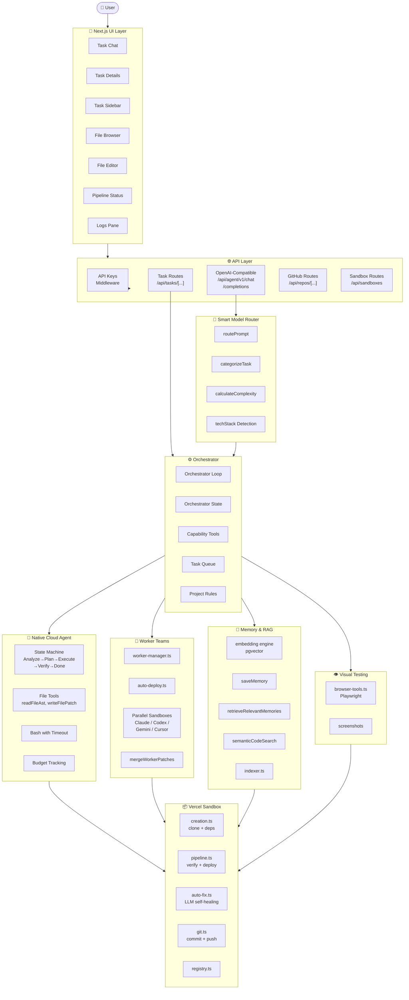
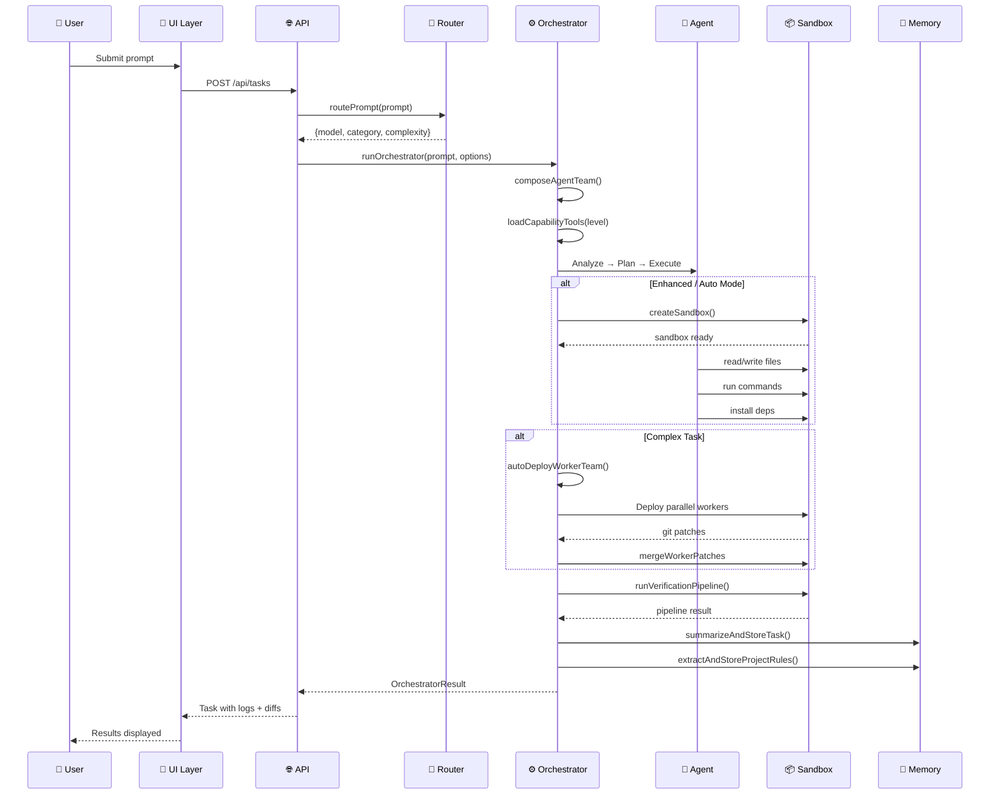
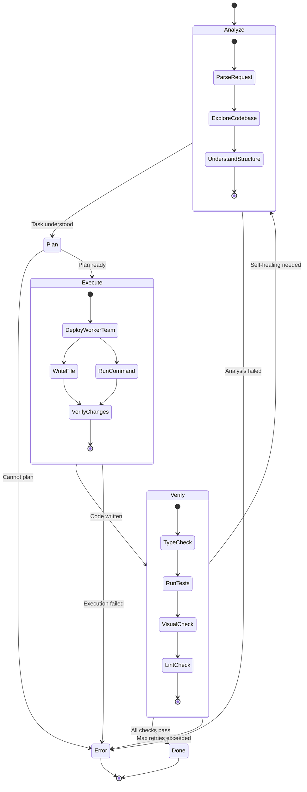
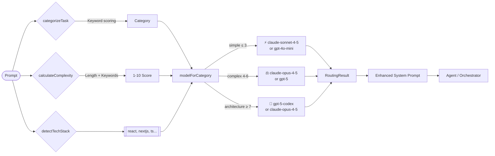
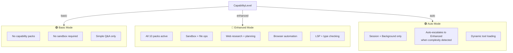
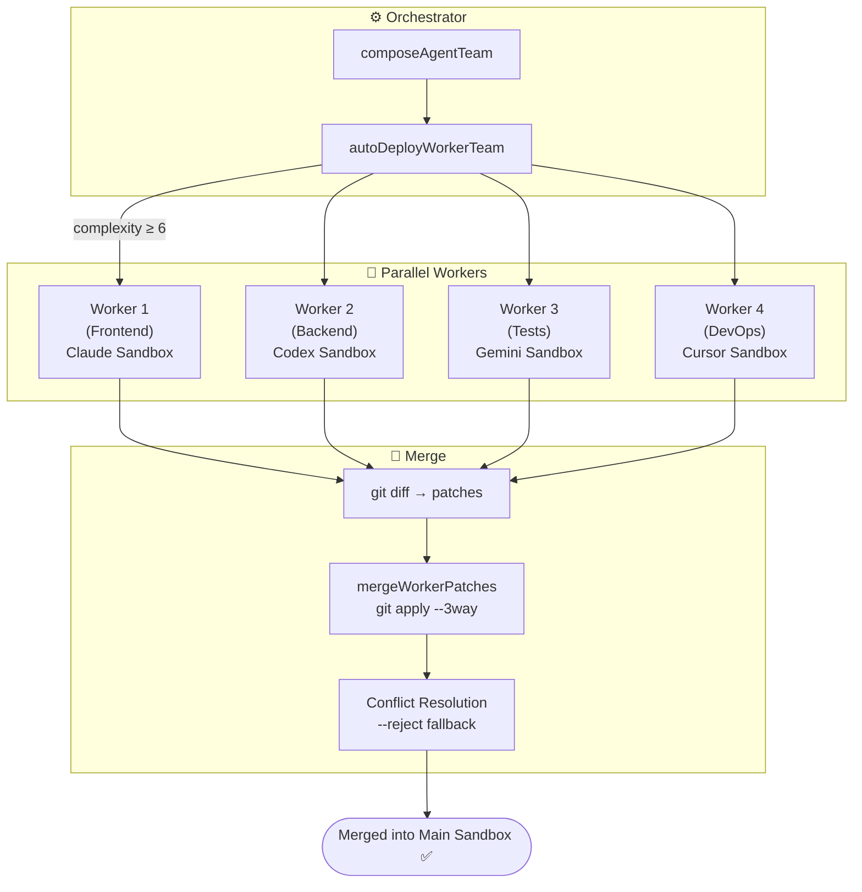
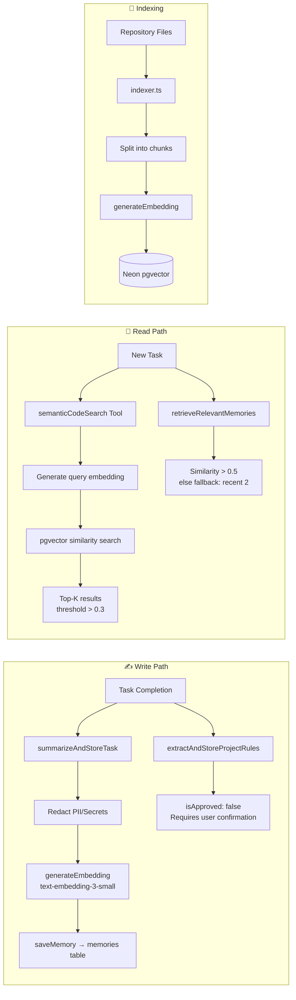
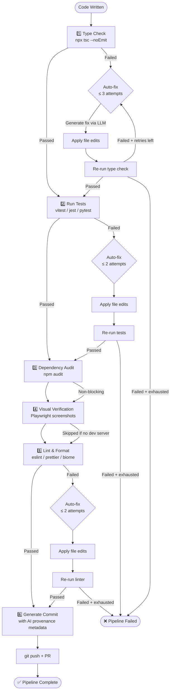
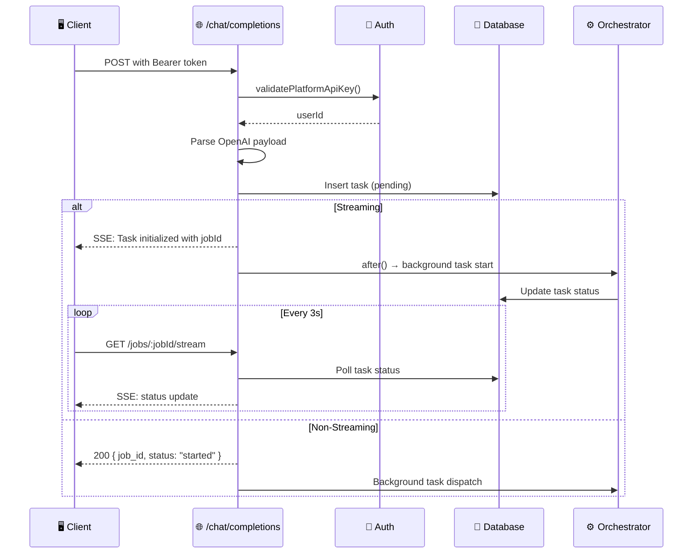
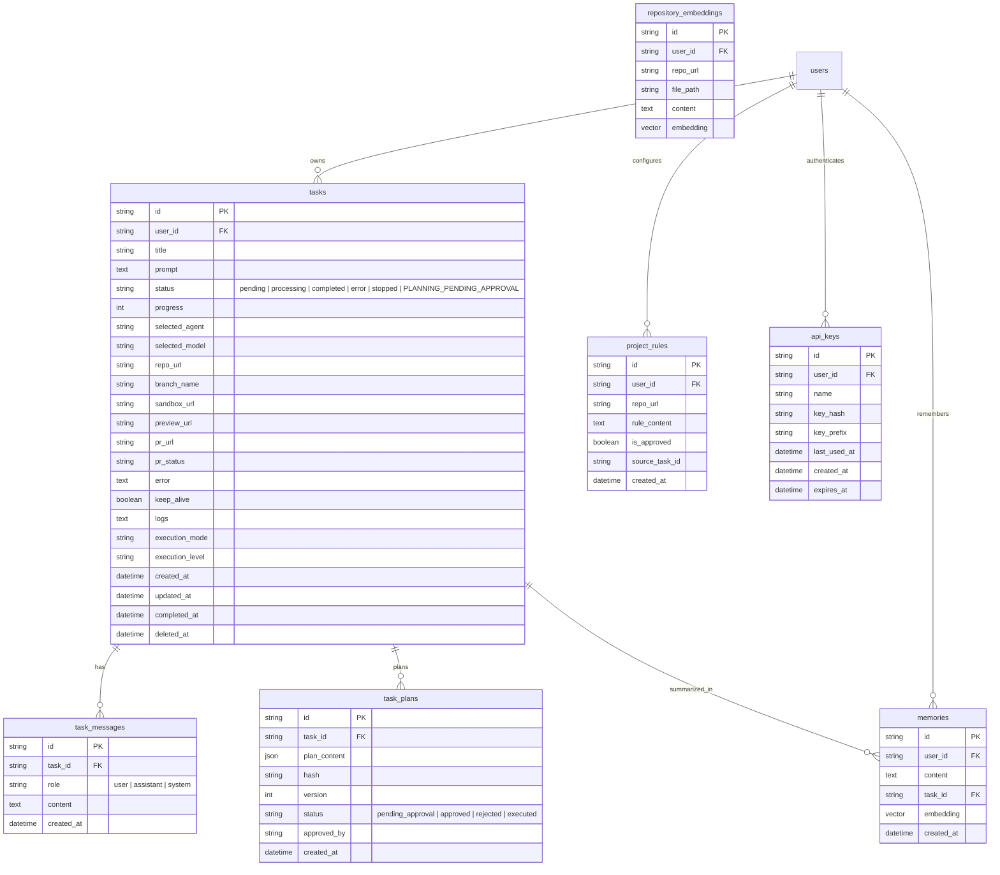

# Architecture Document

> **AI Coding Agent Platform** — a Next.js-based autonomous coding platform with smart model routing, sandboxed execution, parallel worker teams, and visual verification.

---

## 1. System Overview

The platform connects a user's request through a chain of progressively more capable subsystems — from a stateless model router to a fully autonomous orchestrator that deploys parallel agent teams in isolated cloud sandboxes.



---

## 2. Request Flow

### 2.1 Complete Request Lifecycle



### 2.2 Agent State Machine



---

## 3. Core Components

### 3.1 Smart Model Router (`lib/ai/`)

| File | Role | Key Functions |
|------|------|---------------|
| `router.ts` | Rule-based routing engine | `routePrompt()`, `categorizeTask()`, `calculateComplexity()`, `detectTechStack()` |
| `smart-router.ts` | LLM-powered complexity analysis | `analyzePromptComplexity()`, `routePrompt()` with provider-aware selection |
| `models.ts` | Model client factory | `getModelClient()` — returns provider SDK model for any model name, with AI Gateway fallback |
| `model-definitions.ts` | Agent ↔ model registry | `CODING_AGENTS`, `AGENT_MODELS`, `DEFAULT_MODELS`, `getModelName()` |

**Routing Strategy:**



**Complexity Scoring (1–10):**

- **1–2**: Comments, version bumps, trivial changes → fast/cheap models
- **3–4**: Single-function additions, simple bug fixes → balanced models
- **5–7**: Multi-file features, UI components, new API endpoints → powerful models
- **8–10**: Architectural changes, full-stack features, refactoring → elite models + worker teams

**Provider Fallback Chain:**

```
User's API Key → AI Gateway (Vercel) → Direct Provider API → Fallback Model
```

### 3.2 Orchestrator (`lib/ai/orchestrator/`)

| File | Role |
|------|------|
| `loop.ts` | Main agent loop — `runOrchestrator()`, `composeAgentTeam()` |
| `state.ts` | `OrchestratorState` — tracks progress, sub-agent results, checkpoints |
| `tools.ts` | Core tools — `spawnSubAgent()`, `spawnSubAgents()`, `finalize()` |
| `task-queue.ts` | Task queue management — `createTask()`, `listTasks()`, `editTask()`, `deleteTask()` |
| `modes.ts` | Capability level config — `basic`, `enhanced`, `auto` |
| `rules.ts` | Project rules retrieval — `getProjectRules()` |
| `indexer.ts` | Codebase chunk indexing for RAG |

**Capability Packs (`lib/ai/orchestrator/capabilities/`):**

| Pack | Module | Tools Exposed |
|------|--------|---------------|
| `web` | `web-tools.ts` | Web search, URL fetching |
| `plan` | `plan-tools.ts` | `createPlan` with user approval flow |
| `session` | `session-tools.ts` | Checkpoint, restore, fork |
| `background` | `background.ts` | Background task scheduling |
| `research` | `research-tools.ts` | Codebase analysis, dependency audit |
| `file` | `file-tools.ts` | Read, write, edit, glob, grep |
| `shell` | `shell-tools.ts` | Command execution with security constraints |
| `lsp` | `lsp-tools.ts` | Type checking, diagnostics |
| `browser` | `browser-tools.ts` | Playwright navigation, click, fill, screenshot |
| `repo-map` | `repo-map.ts` | `generateRepoMap`, `getFileStructure` |
| `semantic-code-search` | `semantic-code-search.ts` | Vector search over codebase |

**Mode Configuration:**



**Runtime Layer (`lib/ai/orchestrator/runtime/`):**

| File | Role |
|------|------|
| `sandbox-bridge.ts` | `SandboxBridge` — abstraction over sandbox for file ops, commands, glob, grep |
| `plugin-registry.ts` | Plugin + capability pack registration system |
| `persistent-agent.ts` | Scheduled/interval-based agent execution |
| `cap-agent.ts` | Capability agent runner (opencode-ai) |

### 3.3 Sandbox Layer (`lib/sandbox/`)

| File | Role |
|------|------|
| `creation.ts` | Full sandbox lifecycle: create → clone repo → install deps → start dev server → browser deps |
| `commands.ts` | `runCommandInSandbox()`, `runInProject()` — sandbox command execution |
| `pipeline.ts` | 6-stage verification pipeline: Type Check → Tests → Dependency Audit → Visual → Lint → Commit |
| `auto-fix.ts` | LLM-powered auto-fix loop — generates fixes for type/test/lint errors |
| `git.ts` | Git operations: push, PR creation, merge, revert |
| `sandbox-registry.ts` | In-memory sandbox registry for current execution |
| `package-manager.ts` | Auto-detect package manager (npm/pnpm/yarn) and install |
| `config.ts` | Environment validation, authenticated repo URL creation |
| `cost-estimator.ts` | Cost estimation for sandbox execution |
| `local-execution.ts` | Local (non-sandbox) execution mode |
| `port-detection.ts` | Detect project port (3000 vs 5173) from GitHub |
| `code-review.ts` | Code review tool — runs git diff through LLM |
| `types.ts` | `SandboxConfig`, `SandboxResult`, etc. |

**Sandbox Creation Flow:**

```mermaid
flowchart TB
    Start([Create Sandbox]) --> Validate[Validate Env Vars<br/>API keys, GitHub token]
    Validate --> Create[Sandbox.create()]
    Create --> CreateDir[mkdir -p /vercel/sandbox/project]
    CreateDir --> Clone{Has Repo?}
    Clone -->|Yes| GitClone[git clone --depth 1]
    Clone -->|No| Empty[Empty project dir]
    GitClone --> DetectPkg[Detect package.json]
    DetectPkg --> Install{installDeps?}
    Install -->|Yes| PM[Detect package manager]
    PM --> Deps[Install dependencies]
    Deps --> DevServer{Has dev script?}
    DevServer -->|Yes| StartDev[Start dev server<br/>with host config]
    StartDev --> Browser{enableBrowser?}
    DevServer -->|No| Browser
    Browser -->|Yes| InstallBrowser[Install Chromium deps<br/>agent-browser CLI<br/>Playwright + skill files]
    InstallBrowser --> GitConfig[Git config user]
    Browser -->|No| GitConfig
    GitConfig --> Done([Sandbox Ready ✅])
```

### 3.4 Worker Teams (`lib/ai/orchestrator/worker/`)



| File | Role |
|------|------|
| `worker-manager.ts` | `deployWorkerTeam()` — parallel sandbox deployment, `mergeWorkerPatches()` |
| `types.ts` | `WorkerSpec`, `WorkerTeamSpec`, `WorkerResult`, `WorkerTeamResult` |
| `auto-deploy.ts` | `autoDeployWorkerTeam()` — complexity-based automatic team deployment |

**Worker Agent Types:**

| Agent | CLI | Required API Key | Model Default |
|-------|-----|------------------|---------------|
| `claude` | `claude --dangerously-skip-permissions` | `ANTHROPIC_API_KEY` or `AI_GATEWAY_API_KEY` | `claude-sonnet-4-5` |
| `codex` | `codex exec --dangerously-bypass-approvals-and-sandbox` | `OPENAI_API_KEY` or `AI_GATEWAY_API_KEY` | `openai/gpt-4o` |
| `cursor` | `cursor-agent -p --force` | `CURSOR_API_KEY` | `auto` |
| `gemini` | `npx @google/gemini-cli --yolo` | `GEMINI_API_KEY` | `gemini-2.5-pro` (auto-detected) |

### 3.5 Memory & RAG System (`lib/memory/` + `lib/ai/orchestrator/indexer.ts`)



| Component | Store | Schema |
|-----------|-------|--------|
| Task memories | `memories` table | `id, user_id, content, task_id, embedding, created_at` |
| Repository embeddings | `repository_embeddings` table | `id, user_id, repo_url, file_path, content, embedding` |
| Project rules | `project_rules` table | `id, user_id, repo_url, rule_content, is_approved, source_task_id` |

**Security in Memory System:**
- Tenant isolation by `userId` + `repoUrl` in all queries
- Sensitive data redaction via `redactSensitiveData()` before storage
- Rules require explicit user approval (`is_approved: false` by default)
- Rules loaded as untrusted input (not injected into system prompt)

### 3.6 Pipeline & Auto-Fix (`lib/sandbox/pipeline.ts` + `auto-fix.ts`)



**Auto-Fix Structure:**

```
runAutoFixLoop(config):
  1. LLM analyzes error output (generateObject with autoFixSchema)
  2. LLM returns structured patch { explanation, fileEdits[]
  3. Apply patch to sandbox (base64-encoded safe writes)
  4. Re-run failing stage
  5. Repeat up to maxAttempts (3 for types, 2 for tests/lint)
  6. Return full attempt history with durations
```

### 3.7 External API (`app/api/agent/v1/`)

**OpenAI-Compatible Endpoint:**

```
POST /api/agent/v1/chat/completions
Authorization: Bearer <platform-api-key>

{
  "messages": [{ "role": "user", "content": "..." }],
  "model": "agent-router",
  "stream": true,
  "platform_config": {
    "repoUrl": "https://github.com/owner/repo",
    "branchName": "optional-branch",
    "agentConfig": { "selectedAgent": "claude", "keepAlive": false }
  }
}
```

**Job Streaming:**

```
GET /api/agent/v1/jobs/:jobId/stream
Authorization: Bearer <platform-api-key>

SSE Events:
  data: {"object":"platform.job.status","status":"processing","progress":45}
  data: {"object":"platform.job.messages","messages":[...]}
  data: [DONE]
```

**Flow:**



---

## 4. Data Model (Key Schemas)



---

## 5. Key Design Decisions

### 5.1 Why Not Use a Single Agent CLI?

Instead of depending on a single CLI tool (Claude Code, Aider, etc.) inside the sandbox, the platform implements:

1. **`NativeCloudAgent`** (`lib/ai/agent/`) — a pure-TypeScript agent loop using `Vercel AI SDK` directly, with full control over tools, state, and budgets
2. **Agent CLIs as workers** — Claude, Codex, Gemini, and Cursor CLIs are used only for parallel worker teams (extending, not replacing, the native agent)

This gives us:
- Full control over tool definitions and security
- Unified logging and progress tracking
- Budget enforcement (steps, tokens, cost, time)
- Integration with the orchestrator's state machine and capability system

### 5.2 Capability Levels vs. Predefined Packs

The `basic` / `enhanced` / `auto` levels map to capability packs:

- **Basic**: No tools — pure LLM Q&A. Fast, cheap, no sandbox needed.
- **Enhanced**: All 10 packs loaded. Sandbox-backed, full autonomy.
- **Auto**: Minimal start (session + background). Auto-escalates to Enhanced when complexity is detected, enabling dynamic resource allocation.

### 5.3 Worker Team Strategy

Teams are composed by analyzing the prompt for required specialties:
- Frontend, Backend, QA, DevOps specialists are added based on keyword detection
- Each worker runs in its **own Vercel sandbox** with its own agent CLI
- Results are merged via `git apply --3way` with conflict detection
- Falls back gracefully: simple tasks skip teams entirely

### 5.4 Streaming Architecture

The external API streams job status via polling-based SSE:
- `/chat/completions` returns immediately with `job_id`
- Client connects to `/jobs/:jobId/stream` for real-time updates
- Server polls DB every 3s for status changes
- 5-minute max polling duration per connection
- Heartbeats every 15s to keep connection alive

---

## 6. Configuration & Environment

### Required Variables

| Variable | Purpose | Source |
|----------|---------|--------|
| `OPENAI_API_KEY` | GPT models, embeddings | User-provided or platform |
| `ANTHROPIC_API_KEY` | Claude models | User-provided or platform |
| `GEMINI_API_KEY` | Gemini models | User-provided or platform |
| `AI_GATEWAY_API_KEY` | Vercel AI Gateway (router fallback) | Platform |
| `GITHUB_TOKEN` | GitHub API + private repo access | User OAuth |
| `DATABASE_URL` | Neon Postgres connection string | Platform |
| `JWE_SECRET` | Session encryption | Platform |
| `SANDBOX_VERCEL_TOKEN` | Vercel sandbox API | Platform |
| `SANDBOX_VERCEL_TEAM_ID` | Vercel team | Platform |
| `SANDBOX_VERCEL_PROJECT_ID` | Vercel project | Platform |

### Client-Safe (`NEXT_PUBLIC_`)

| Variable | Purpose |
|----------|---------|
| `NEXT_PUBLIC_AUTH_PROVIDERS` | Available auth providers |
| `NEXT_PUBLIC_GITHUB_CLIENT_ID` | GitHub OAuth public client ID |

---

## 7. Implementation Status

| Phase | Component | Status |
|-------|-----------|--------|
| 1 | Smart Model Router — complexity analysis | ✅ Complete |
| 1 | Fallbacks & resilience | 🟡 Partial (no exponential backoff) |
| 1 | Load balancing & rate limits | 🟡 Partial (AI Gateway basic only) |
| 2 | OpenAI-compatible API | 🟡 Partial (real streaming pending) |
| 2 | Auth & API keys | ✅ Complete |
| 2 | Sandbox sync & diff return | 🟡 Partial (no diff format, cancellation, idempotency) |
| 3 | Native Cloud Agent loop | ✅ Complete |
| 3 | Custom sandbox tools | ✅ Complete |
| 3 | Self-healing & LSP | 🟡 Partial (auto-fix works, no full LSP server) |
| 4 | Repo-wide RAG | ✅ Complete |
| 4 | Human-in-the-loop planning | ✅ Complete |
| 4 | Long-term memory & rules | ✅ Complete |
| 5 | Headless browser | ✅ Complete |
| 5 | Visual QA critique loop | ❌ Not implemented |

---

## 8. Cross-Cutting Concerns

### 8.1 Security

- **No dynamic values in logs** — all `logger.info()` / `logger.error()` calls use static strings only
- **Sensitive data redaction** — `redactSensitiveInfo()` redacts API keys, tokens, secrets from all logged output
- **Sandbox isolation** — each sandbox is isolated by Vercel's infrastructure with resource limits
- **Command allowlisting** — `runBashWithTimeout` only permits approved commands
- **API key hashing** — stored as hashed values in database
- **Tenant isolation** — all data queries include both `userId` and `repoUrl` filters

### 8.2 Error Handling

- Static error messages in user-facing logs; detailed errors in server-side `console.error()`
- Auto-fix loops for type errors, test failures, and lint issues
- Graceful fallback: if sandbox creation fails → user is notified without crash
- Worker team failures → orchestrator falls back to single-agent execution
- Task queue tools are best-effort (catch errors, continue)

### 8.3 Observability

- `TaskLogger` — per-task logging with static messages
- Pipeline status tracking — each stage records duration, status, and truncated errors
- Agent step counting and budget tracking
- Worker team result aggregation with per-worker summaries
- Checkpoint system for orchestrator state persistence
- Job streaming via SSE for external API consumers

---

## 9. Directory Map

```
lib/
├── ai/
│   ├── router.ts                 # Rule-based model routing
│   ├── smart-router.ts           # LLM-based complexity analysis
│   ├── models.ts                 # Model client factory
│   ├── model-definitions.ts      # Agent ↔ model registry
│   ├── agent/
│   │   ├── index.ts              # NativeCloudAgent class
│   │   ├── tools.ts              # readFileAst, writeFilePatch, runBashWithTimeout
│   │   ├── types.ts              # AgentState, TaskBudgets, etc.
│   │   └── validation.ts        # Project validation (tsc)
│   └── orchestrator/
│       ├── loop.ts               # Main orchestrator loop
│       ├── state.ts              # OrchestratorState
│       ├── tools.ts              # spawnSubAgent, finalize
│       ├── task-queue.ts         # Task queue management tools
│       ├── modes.ts              # Capability level config
│       ├── rules.ts              # Project rules retrieval
│       ├── indexer.ts            # RAG codebase indexing
│       ├── capabilities/
│       │   ├── types.ts          # CapabilityLevel, ToolContext, etc.
│       │   ├── index.ts          # Pack registration & loading
│       │   ├── web-tools.ts      # Web search & fetch
│       │   ├── plan-tools.ts     # Planning with approval
│       │   ├── session-tools.ts  # Checkpoints & restore
│       │   ├── background.ts     # Background tasks
│       │   ├── research-tools.ts # Codebase research
│       │   ├── file-tools.ts     # File operations
│       │   ├── shell-tools.ts    # Shell execution
│       │   ├── lsp-tools.ts      # LSP diagnostics
│       │   ├── browser-tools.ts  # Playwright automation
│       │   ├── repo-map.ts       # Codebase map generation
│       │   └── semantic-code-search.ts  # Vector search
│       ├── worker/
│       │   ├── worker-manager.ts # Parallel sandbox deployment & merge
│       │   ├── types.ts          # WorkerSpec, WorkerTeamSpec
│       │   └── auto-deploy.ts    # Complexity-based auto deployment
│       └── runtime/
│           ├── sandbox-bridge.ts # Sandbox abstraction layer
│           ├── plugin-registry.ts# Plugin registration system
│           ├── persistent-agent.ts # Scheduled agent execution
│           └── cap-agent.ts      # Capability agent runner
├── memory/
│   ├── engine.ts                 # Embedding generation & vector search
│   ├── mention-parser.ts         # @task and @agent mention parsing
│   └── summarize.ts              # Task summarization & rule extraction
├── sandbox/
│   ├── creation.ts               # Full sandbox lifecycle
│   ├── commands.ts               # Command execution utilities
│   ├── pipeline.ts               # 6-stage verification pipeline
│   ├── auto-fix.ts               # LLM auto-fix loop engine
│   ├── git.ts                    # Git operations
│   ├── sandbox-registry.ts       # In-memory sandbox registry
│   ├── config.ts                 # Environment validation
│   ├── package-manager.ts        # Package manager detection
│   ├── cost-estimator.ts         # Cost estimation
│   ├── local-execution.ts        # Local execution mode
│   ├── port-detection.ts         # Port detection from GitHub
│   ├── code-review.ts            # Code review tool
│   └── types.ts                  # Sandbox types
└── db/
    └── schema.ts                 # All database table definitions
```
