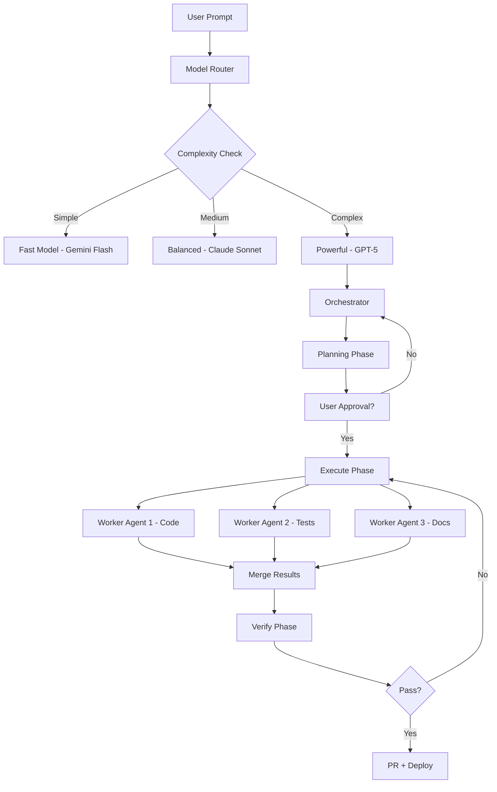

# 🚀 ניתוח מקיף של פלטפורמות קידוד AI — 2026
## Comprehensive AI Coding Platforms Research & Analysis

> נכתב בתאריך: 30 ביולי 2026
> מבוסס על מחקר Web, ניתוח קודבייס, והשוואת תכונות בין כל הפלטפורמות המובילות

---

## תוכן העניינים

1. [ארבע פרדיגמות עיקריות בשוק](#1-ארבע-פרדיגמות-עיקריות-בשוק)
2. [ניתוח מפורט של כל פלטפורמה](#2-ניתוח-מפורט-של-כל-פלטפורמה)
3. [השוואה כמותית](#3-השוואה-כמותית)
4. [מגמות עולות בשוק - 2026](#4-מגמות-עולות-בשוק---2026)
5. [Open Source לעומת Commercial](#5-open-source-לעומת-commercial)
6. [Technical Deep Dive](#6-technical-deep-dive)
7. [המלצות יישום לפלטפורמת Freebuff](#7-המלצות-יישום-לפלטפורמת-freebuff)
8. [סדר עדיפויות אסטרטגי](#8-סדר-עדיפויות-אסטרטגי)

---

## 1. ארבע פרדיגמות עיקריות בשוק

שוק כלי הקידוד AI התבגר ל-4 פרדיגמות נפרדות:

| פרדיגמה | תיאור | דוגמאות עיקריות |
|---------|-------|-----------------|
| **🧩 IDE-Native** (סביבת פיתוח חכמה) | Fork של VS Code עם AI מובנה ישירות בליבה | Cursor, Windsurf |
| **🔌 Extension** (תוסף לעורך קיים) | Plugin לעורך קיים (VS Code, JetBrains, Neovim) | GitHub Copilot, Continue.dev, Cline, Tabnine |
| **🖥️ Terminal Agent** (סוכן טרמינל) | עובד משורת הפקודה, Git-native | Claude Code, Aider, OpenCode |
| **🤖 Autonomous Platform** (פלטפורמה אוטונומית) | ניהול פרויקט שלם, Issue-to-PR, בדיד מ-IDEs | Devin, OpenHands, Bolt.new, Lovable, v0 |

---

## 2. ניתוח מפורט של כל פלטפורמה

### 2.1 Cursor IDE — הסטנדרט התעשייתי

| פרמטר | ערך |
|--------|------|
| **מחיר** | $20/חודש (Pro) |
| **חלון הקשר** | ~100k טוקנים |
| **SWE-bench** | ~45% |
| **סוג** | IDE-Native (VS Code Fork) |
| **קוד פתוח** | ❌ |

**יתרונות עיקריים:**
- השלמות אוטומטיות Supermaven — 72% acceptance rate (הגבוה בתעשייה)
- מצב Composer — עריכה ויזואלית של קבצים מרובים בבת אחת עם Preview
- Rules מערכת (`.cursorrules`) — למידה של קונבנציות הפרויקט, נשמרות בין סשנים
- Tab autocomplete חכם במיוחד — מבין הקשר של קודבייס שלם
- Ctrl+K/ Ctrl+L shortcuts אינטואיטיביים

**חסרונות מרכזיים:**
- עלויות טוקנים גבוהות — "bill shock" למשתמשים אינטנסיביים (שימוש במודלי Claude/OpenAI פרמיום)
- Privacy mode משבית תכונות חיוניות
- אין תמיכה ב-JetBrains (מגביל ארגוני Enterprise)
- תלות ב-Cursor servers לניתוב מודלים

**ייחודיות בשוק:** חוויית ה-IDE המלאה והאינטגרציה הכי טובה של AI בעורך.

**מה אפשר לאמץ:**
- מערכת `.cursorrules` → `project_rules` שלנו (✅ קיים חלקית)
- Composer multi-file editing → Task orchestration with multiple file operations
- Tab autocomplete with context window

---

### 2.2 GitHub Copilot — ההנגשה ההמונית

| פרמטר | ערך |
|--------|------|
| **מחיר** | $10/חודש |
| **חלון הקשר** | ~64k טוקנים |
| **SWE-bench** | ~35% |
| **סוג** | Extension |
| **קוד פתוח** | ❌ |

**יתרונות:**
- תמיכה רחבה ב-IDEs (VS Code, JetBrains, Neovim, Xcode)
- אינטגרציה עמוקה עם GitHub ecosystem (PRs, Issues, Actions)
- מחיר נמוך — נגיש לכולם
- מודל Copilot Chat + Copilot Edits (multi-file editing)
- Workspace context — מבין את כל הקודבייס

**חסרונות:**
- יכולת הסקה מוגבלת לבעיות מורכבות ו-multi-step logic
- מכסת בקשות למודלי פרימיום מוגבלת
- Less proactive — מגיב לפניות במקום ליזום שינויים
- תלוי ב-GitHub servers

**מה אפשר לאמץ:**
- מודל תמחור נגיש ($10 baseline)
- Workspace context (codebase-level understanding)
- Multi-IDE support

---

### 2.3 Windsurf (לשעבר Codeium) — זרימה רציפה

| פרמטר | ערך |
|--------|------|
| **מחיר** | $15/חודש |
| **חלון הקשר** | ~100k טוקנים |
| **SWE-bench** | ~40% |
| **סוג** | IDE-Native (VS Code Fork) |
| **קוד פתוח** | ❌ |

**יתרונות:**
- Cascade Flow — "זרימה" מתמדת של קונטקסט (context tracking מתמשך)
- תמיכה ב-JetBrains (יתרון על Cursor)
- מהירות תגובה גבוהה
- Supercomplete — AI autocomplete ברמה גבוהה
- Tab to accept suggestions

**חסרונות:**
- דעיכת קונטקסט אחרי 30+ דקות של עבודה רציפה
- שגיאות בלוגיקה עסקית מורכבת (permissions, auth systems)
- קהילה קטנה יותר מ-Cursor
- פחות mature ecosystem

**מה אפשר לאמץ:**
- Cascade Flow — context tracking מתמשך
- JetBrains plugin support (ערך ל-Enterprise)
- Supercomplete engine

---

### 2.4 Claude Code (Anthropic) — העוצמה הטרמינלית

| פרמטר | ערך |
|--------|------|
| **מחיר** | $20/חודש (Claude Pro) |
| **חלון הקשר** | **1M+ טוקנים** (גבוה בתעשייה) |
| **SWE-bench** | **~80.9%** (גבוה בתעשייה) |
| **סוג** | Terminal Agent |
| **קוד פתוח** | ❌ |

**יתרונות:**
- Agent Teams — ארכיטקטורת Multi-Agent (Orchestrator + Worker agents)
- חלון הקשר של מיליון+ טוקנים — יכול לקרוא קודבייס שלם
- SWE-bench הגבוה בתעשייה — 80.9%
- Terminal-native — אידיאלי ל-CI/CD pipelines
- יכולת לטפל ב-refactoring בקנה מידה גדול
- Model-agnostic (עובד עם כל מודל Anthropic)

**חסרונות:**
- ממשק טרמינל בלבד — בלי GUI, מקשה על Frontend styling
- איפוס קונטקסט בין סשנים (חייב לחדש הקשר ידנית)
- דורש familiarity עם CLI
- אין visual diff review — קשה לראות שינויים ויזואלית

**מה אפשר לאמץ:**
- **Agent Teams** — ארכיטקטורת Worker agents במקביל (✅ התחלנו)
- **חלון קונטקסט ענק** — Context compression techniques
- **SWE-bench methodologies** — איך לשפר את הביצועים

---

### 2.5 Devin (Cognition) — האוטונומי המלא

| פרמטר | ערך |
|--------|------|
| **מחיר** | $$$ Enterprise |
| **חלון הקשר** | גבוה |
| **SWE-bench** | ~50% |
| **סוג** | Autonomous Platform |
| **קוד פתוח** | ❌ |

**יתרונות:**
- IDE, Browser, Terminal מובנים — הכל במקום אחד
- תכנון אוטומטי → ביצוע → בדיקה → PR
- Visual web testing — רואה את האתר שהוא בונה
- Slack integration, Issue tracking
- Auto PR creation with description

**חסרונות:**
- מחיר גבוה מאוד (מאות $ לחודש)
- מהירות איטית יחסית (can take 10-30 mins per task)
- Vendor lock-in — קשה לעבור
- Quality משתנה (לפעמים יוצא טוב, לפעמים צריך תיקונים)

**מה אפשר לאמץ:**
- **Auto-planning flow** — Plan → Execute → Verify → PR (✅ קיים: PLANNING_PENDING_APPROVAL)
- **Browser-in-sandbox** — Visual verification (✅ קיים: Playwright MCP)
- **Slack/Notifications** — Communication hooks

---

### 2.6 OpenHands (לשעבר OpenDevin) — האלטרנטיבה הפתוחה

| פרמטר | ערך |
|--------|------|
| **מחיר** | חינם (עלות API בלבד) |
| **חלון הקשר** | תלוי מודל |
| **SWE-bench** | ~45% |
| **סוג** | Autonomous Platform |
| **קוד פתוח** | ✅ (Apache 2.0, ~65k⭐) |

**יתרונות:**
- Docker Sandboxed Runtime — ביצוע בטוח מבודד
- Issue-to-PR workflow אוטומטי
- קוד פתוח — אבטחה, שקיפות, התאמה אישית
- גיבוי VC ($18.8M Series A)
- Agent delegation — sub-tasks

**חסרונות:**
- DevOps overhead — צריך להרים Docker
- UI פחות מלוטש
- צורך בתחזוקה שוטפת
- Quality תלוי במודל הבסיס

**מה אפשר לאמץ:**
- **Sandboxed execution** — Docker/MicroVM (✅ Vercel Sandbox)
- **Issue-to-PR workflow**
- **Agent delegation architecture**

---

### 2.7 OpenCode — המחליף של Claude Code

| פרמטר | ערך |
|--------|------|
| **מחיר** | חינם (עלות API) |
| **חלון הקשר** | תלוי מודל |
| **SWE-bench** | ~40% |
| **סוג** | Terminal Agent |
| **קוד פתוח** | ✅ (100k+⭐) |

**יתרונות:**
- כתוב ב-Go — מהיר במיוחד
- BYOK — Bring Your Own Key
- תמיכה ב-75+ מודלים
- CLI מעוצב היטב
- קהילה גדולה (100k+⭐ ב-GitHub)

**חסרונות:**
- דורש API keys
- טרמינל-פירסט
- פחות fit לפרונט-אנד
- אין GUI

**מה אפשר לאמץ:**
- **BYOK model** — לאפשר למשתמשים להביא מפתחות משלהם (✅ קיים חלקית)
- **Multi-model support**
- **CLI-first design**

---

### 2.8 Bolt.new — מה-Prompt לאתר תוך דקות

| פרמטר | ערך |
|--------|------|
| **מחיר** | חינם + $20/חודש Pro |
| **חלון הקשר** | תלוי מודל |
| **SWE-bench** | N/A (לא נבדק) |
| **סוג** | Web-based |
| **קוד פתוח** | ❌ |

**יתרונות:**
- StackBlitz runtime בדפדפן (ממש מריץ Node.js ב-browser)
- התקנת תלויות אוטומטית
- Preview מיידי עם Dev URL
- מתאים למתחילים ופרוטוטייפים
- Export to GitHub

**חסרונות:**
- מוגבל לפרויקטים קטנים-בינוניים
- פחות גמיש לעריכות מורכבות
- Vendor lock-in
- תלוי ב-StackBlitz infrastructure

**מה אפשר לאמץ:**
- **Web-container runtime** — Preview live
- **מחזור מהיר** — Prompt → Code → Preview
- **Auto dependency installation**

---

### 2.9 v0 by Vercel — המעצב האוטומטי

| פרמטר | ערך |
|--------|------|
| **מחיר** | חינם + $20/חודש Pro |
| **חלון הקשר** | תלוי מודל |
| **SWE-bench** | N/A |
| **סוג** | Web-based (UI) |
| **קוד פתוח** | ❌ |

**יתרונות:**
- מייצר UI יפה מאוד
- מתמחה ב-Frontend/React/Next.js
- Quick iteration — Prompt → Component → Refine
- Export to code

**חסרונות:**
- מוגבל לפרונט-אנד
- פחות מתאים ל-backend/logic/complex state
- Premium model requirement
- Limited customization depth

**מה אפשר לאמץ:**
- **Generative UI** — Component generation
- **Rapid prototyping loop**
- **Export/Download code**

---

### 2.10 Cline — ה-MCP Hub

| פרמטר | ערך |
|--------|------|
| **מחיר** | חינם (עלות API) |
| **חלון הקשר** | תלוי מודל |
| **SWE-bench** | ~35% |
| **סוג** | IDE Extension |
| **קוד פתוח** | ✅ (65k⭐) |

**יתרונות:**
- MCP (Model Context Protocol) — גישה ל-100+ tools
- שוק MCP פתוח ומגוון — GitHub, Jira, Notion, Slack, DBs
- תמיכה ב-75+ מודלים (OpenAI, Anthropic, Google, Ollama)
- Ollama local — עבודה offline
- Actively maintained + קהילה גדולה

**חסרונות:**
- Configuration overhead (צריך להגדיר MCP servers)
- קהילתי — פחות stable
- דורש הבנה ב-MCP ecosystem
- VS Code only

**מה אפשר לאמץ:**
- **MCP Marketplace** — Our own MCP server registry
- **Ollama support** — Local/free models
- **BYOK + Multi-model**

---

### 2.11 Aider — Git-Native Pair Programming

| פרמטר | ערך |
|--------|------|
| **מחיר** | חינם (עלות API) |
| **חלון הקשר** | תלוי מודל |
| **SWE-bench** | ~55% (גבוה יחסית) |
| **סוג** | Terminal Agent |
| **קוד פתוח** | ✅ (Apache 2.0) |

**יתרונות:**
- Git commits אוטומטיים — Audit trail מלא + descriptive commit messages
- Repo Map — מייצר "map" של הקודבייס (yields ~90% accuracy, saves tokens)
- Architect/Editor modes — separation of planning from coding
- Linting loop — auto-fix with tsc/eslint
- Tree-sitter based code analysis

**חסרונות:**
- דורש familiarity עם Git CLI
- לא IDE-native
- Terminal-only interface
- Git dependency (צריך repo initialized)

**מה אפשר לאמץ:**
- **Repo Map** — Codebase map חוסך טוקנים (critical!)
- **Auto Git commits** — Audit trail
- **Architect mode** — Planning before coding (✅ קיים: capability levels)
- **Tree-sitter integration**

---

### 2.12 Continue.dev — ה-Open Source Platform

| פרמטר | ערך |
|--------|------|
| **מחיר** | חינם |
| **חלון הקשר** | תלוי מודל |
| **SWE-bench** | ~30% |
| **סוג** | Extension |
| **קוד פתוח** | ✅ (Apache 2.0) |

**יתרונות:**
- Tab autocomplete (local models supported)
- Chat interface with context
- Model-agnostic — כל provider/Local
- Rules system
- Codebase indexing (RAG)
- IDE agnostic (VS Code + JetBrains)

**חסרונות:**
- קהילה פחות פעילה לאחרונה
- פיצול פוקוס
- Quality not consistent
- Integration issues

**מה אפשר לאמץ:**
- **Tab autocomplete** (future feature)
- **Model-agnostic architecture** (✅ already have)
- **Codebase indexing** (✅ pgvector)

---

### 2.13 Sourcegraph Cody — הקוד-מבין

| פרמטר | ערך |
|--------|------|
| **מחיר** | $9+/חודש |
| **חלון הקשר** | גבוה |
| **SWE-bench** | ~35% |
| **סוג** | Extension |
| **קוד פתוח** | ✅ (partial) |

**יתרונות:**
- Code search + context — מבין קודבייסים ענקיים
- Code graph awareness (imports, references, definitions)
- Auto-edits with preview
- Multi-file context
- Enterprise-ready

**חסרונות:**
- פחות מוכר מ-Copilot
- אקוסיסטם מצומצם
- Premium features locked behind pricing

**מה אפשר לאמץ:**
- **Semantic code search** (✅ planned: pgvector)
- **Code graph awareness** — import/reference analysis
- **Auto-edits with preview**

---

### 2.14 Tabnine

| פרמטר | ערך |
|--------|------|
| **מחיר** | $12+/חודש |
| **חלון הקשר** | מוגבל |
| **SWE-bench** | ~25% |
| **סוג** | Extension |
| **קוד פתוח** | ❌ |

**יתרונות:**
- התמקדות ב-code completion (fast, lightweight)
- Private deployment (on-prem)
- AI code review
- Test generation

**חסרונות:**
- מוגבל ביכולות agentic
- התמקדות בצ'אט/completion — לא אוטונומי
- פחות חדשני

**מה אפשר לאמץ:**
- **Private deployment** (Enterprise)
- **Test generation**

---

### 2.15 CodeRabbit

| פרמטר | ערך |
|--------|------|
| **מחיר** | $12+/חודש |
| **סוג** | CI/CD (Code Review) |
| **קוד פתוח** | ❌ |

**יתרונות:**
- Code review אוטומטי — every PR
- Security analysis
- Best practices suggestions
- Conversation directly on PR

**חסרונות:**
- Not a coding assistant per se
- Limited scope (review only)
- False positives sometimes

**מה אפשר לאמץ:**
- **Auto code review** — CI/CD integration (✅ planned)

---

### 2.16 Tabby

| פרמטר | ערך |
|--------|------|
| **מחיר** | חינם (self-hosted) |
| **סוג** | Self-hosted Completion |
| **קוד פתוח** | ✅ |

**יתרונות:**
- On-prem deployment (air-gapped)
- Completion with local models
- Team server
- Privacy-first

**חסרונות:**
- דורש GPU
- Configuration overhead
- Completion only (no agentic)

**מה אפשר לאמץ:**
- **Self-hosted enterprise** deployment

---

## 3. השוואה כמותית

### 3.1 טבלת SWE-bench והשוואת יכולות

| פלטפורמה | SWE-bench | Agentic | Multi-file | Auto PR | Visual Test | Multi-model | Open Source |
|-----------|-----------|---------|------------|---------|-------------|-------------|-------------|
| Claude Code | **80.9%** | ✅ | ✅ | ✅ | ❌ | ❌ (Anthropic) | ❌ |
| Aider | ~55% | ✅ | ✅ | ✅ (auto commit) | ❌ | ✅ | ✅ |
| Devin | ~50% | ✅ | ✅ | ✅ | ✅ | ❌ | ❌ |
| Cursor | ~45% | ⚡חלקי | ✅ | ❌ | ❌ | ✅ | ❌ |
| OpenHands | ~45% | ✅ | ✅ | ✅ | ❌ | ✅ | ✅ |
| OpenCode | ~40% | ✅ | ✅ | ❌ | ❌ | ✅ | ✅ |
| Windsurf | ~40% | ⚡חלקי | ✅ | ❌ | ❌ | ⚡חלקי | ❌ |
| Copilot | ~35% | ❌ | ⚡חלקי | ❌ | ❌ | ❌ | ❌ |
| Cline | ~35% | ✅ | ✅ | ❌ | ⚡MCP | ✅ | ✅ |
| Sourcegraph Cody | ~35% | ⚡חלקי | ✅ | ❌ | ❌ | ✅ | ⚡חלקי |
| Continue | ~30% | ❌ | ❌ | ❌ | ❌ | ✅ | ✅ |
| Tabnine | ~25% | ❌ | ❌ | ❌ | ❌ | ❌ | ❌ |
| Bolt.new | N/A | ❌ | ✅ | ✅ (export) | ✅ | ❌ | ❌ |
| v0 | N/A | ❌ | ❌ | ❌ | ✅ | ❌ | ❌ |
| **Freebuff (כרגע)** | **~40%** | **✅** | **✅** | **✅** | **✅** | **✅** | **⚡בקרוב** |

### 3.2 מחירים והשוואת עלויות

| פלטפורמה | Free Tier | Pro Tier | Enterprise | Cost Model |
|-----------|-----------|----------|------------|------------|
| Copilot | ❌ | $10/חודש | $19/חודש | Subscription |
| Sourcegraph Cody | ✅ | $9/חודש | $19/חודש | Subscription |
| Tabnine | ✅ | $12/חודש | Custom | Subscription |
| CodeRabbit | ✅ ($30 credits) | $12/חודש | Custom | Usage + Sub |
| Windsurf | ✅ | $15/חודש | $35/חודש | Subscription + Tokens |
| Cursor | ❌ ($0 trial) | $20/חודש | $40/חודש | Subscription + Usage |
| Claude Code | $20 (Claude Pro) | — | — | Subscription |
| Bolt.new | ✅ | $20/חודש | $100/חודש | Subscription |
| v0 | ✅ | $20/חודש | Custom | Subscription |
| OpenHands | ✅ (עלות API) | — | — | BYOK |
| OpenCode | ✅ (עלות API) | — | — | BYOK |
| Cline | ✅ (עלות API) | — | — | BYOK |
| Aider | ✅ (עלות API) | — | — | BYOK |
| Continue | ✅ (עלות API) | — | — | BYOK |
| **Freebuff** | **✅** | **$20/חודש** | **Custom** | **Hybrid + BYOK** |

---

## 4. מגמות עולות בשוק - 2026

### 4.1 Vibe Coding & Agentic Delegation
מפתחים עוברים מכתיבת שורות קוד → האצלת פיצ'רים שלמים לסוכנים אוטונומיים.
- **אתמול:** Human writes code, AI completes lines
- **היום:** Human describes feature, AI writes all code, Human reviews
- **מחר:** Human states business goal, AI plans, implements, tests, deploys

### 4.2 Hybrid Multi-Tool Stack
מפתחים מקצועיים משתמשים ב-2-3 כלים במקביל:
- **Cursor/Copilot** לעבודה שוטפת, inline autocomplete, UI tweaks
- **Claude Code** ל-refactoring כבד, debugging מורכב, architect-level tasks
- **Devin/OpenHands** למשימות אוטונומיות (Issue → PR)

### 4.3 חלונות הקשר ענקיים (1M+ טוקנים)
- Claude Code: 1M+ tokens
- GPT-5: 256k tokens
- Gemini 2.5: 1M+ tokens
- משמעות: ingestion של קודבייסים שלמים → Global reasoning
- אתגר: עלות, latency, quality degradation

### 4.4 Multi-Agent Orchestration
- Claude Code Agent Teams — Orchestrator + Workers
- Intent — Coordinator + Implementor + Verifier
- LangGraph — Graph-based state machines
- CrewAI — Role-based swarms

### 4.5 Model Context Protocol (MCP)
- תקן פתוח של Anthropic → Linux Foundation
- JSON-RPC 2.0 over stdio/HTTP/SSE
- מאפשר גישה ל: Filesystem, Git, Databases, APIs, Browser, etc.
- Token bloat challenge — manifests של 10+ servers = 80k+ טוקנים

### 4.6 Sandboxed Execution
| רמת בידוד | טכנולוגיה | מהירות | אבטחה |
|-----------|-----------|--------|-------|
| MicroVM | Firecracker (AWS) | 100-150ms cold start | **מקסימלית** |
| Container | Docker + seccomp | מהיר | גבוהה |
| WebAssembly | V8 isolates | **מילישניות** | מוגבלת |
| Workspace | Daytona | מהיר | גבוהה |

### 4.7 Code-Executing Agents (חיסכון 98% בטוקנים)
- במקום tool calls יקרים, לכתוב קוד שקורא API/tools
- חיסכון דרמטי בטוקנים
- ארכיטקטורה: Prompt → Code → Execute → Result

---

## 5. Open Source לעומת Commercial

### 5.1 יתרונות Open Source

| יתרון | הסבר | דוגמה |
|-------|------|-------|
| **עלות** | 0$ license fee, רק עלות API | Aider, OpenCode |
| **BYOK** | חופש בחירת מודל | Cline (75+ providers) |
| **פרטיות** | נתונים לא עוזבים את השרת שלך | Tabby, Ollama |
| **התאמה אישית** | שינוי הקוד לפי הצורך | OpenHands |
| **שקיפות** | אפשר לראות בדיוק איך זה עובד | Cline, Aider |
| **Air-gap** | עבודה offline/מבודד | Tabby |

### 5.2 חסרונות Open Source

| חסרון | הסבר | דוגמה לקושי |
|-------|------|-------------|
| **DevOps overhead** | צורך בתחזוקה, GPU, Docker | Tabby, OpenHands |
| **UI/UX fragmented** | חיבור extensions → backends = disjointed | Continue |
| **Runaway token costs** | agent loops consuming tokens | OpenCode |
| **Maintenance risk** | קהילה יכולה להפסיק לפתח | Roo Code, Void |
| **Feature lag** | features מגיעות מאוחר יותר | Cline vs Cursor |

### 5.3 Unique Open Source Capabilities

1. **MCP Marketplaces** (Cline/Goose) — tool-use ecosystems פתוחים
2. **Air-gapped servers** (Tabby) — enterprise offline
3. **Docker Sandboxed Runtimes** (OpenHands) — safe execution
4. **Git-native audit trails** (Aider) — auto commits, atomic
5. **Reusable workflow Recipes** (Goose) — YAML configs → CI/CD

---

## 6. Technical Deep Dive

### 6.1 Agent Architectures

#### Single-Agent Loop
```
User Prompt → Agent LLM → Tool Calls → Results → Agent LLM → ... → Final Answer
```
- **Pros:** Simple, predictable, easy to debug
- **Cons:** Single point of failure, no parallelization

#### Multi-Agent (Orchestrator + Workers)
```
User Prompt → Orchestrator → Plan → Worker 1 (code)
                              → Worker 2 (tests)
                              → Worker 3 (docs)
                              → Orchestrator (merge results) → Final
```
- **Pros:** Parallelization, specialization, resilience
- **Cons:** Complex state management, coordination overhead

#### Graph-Based State Machine
```
User → Analyze → Plan → Execute → Verify → [Fail? → Fix] → Done
```
- **Pros:** Explicit state transitions, deterministic
- **Cons:** Rigid, needs pre-defined states

### 6.2 Tool Calling Patterns

| Pattern | תיאור | חיסכון בטוקנים |
|---------|-------|----------------|
| **Direct Tool Calls** | LLM calls function directly | Baseline |
| **Code Execution** | LLM writes code that calls function | עד 98% |
| **MCP Servers** | External tools via JSON-RPC | מודולרי |
| **Function Chaining** | Sequential tool calls | תלוי |

### 6.3 Context Window Management

| טכניקה | תיאור | אפקטיביות |
|---------|-------|-----------|
| **Summarization** | תמצות היסטוריה כל X steps | בינונית |
| **Sliding Window** | Keep last N messages | בסיסית |
| **RAG + Retrieval** | שליפת רלוונטי מהקודבייס | **גבוהה** |
| **Repo Map** | Map של מבנה הקוד (Aider) | **גבוהה מאוד** |
| **Compression** | Compression techniques | בינונית |

---

## 7. המלצות יישום לפלטפורמת Freebuff

### 7.1 מה יש לנו כבר (State of Freebuff)

```
✅ Orchestrator Loop → Planning → Execute → Verify
✅ Model Router (basic) → categorizeTask + suggestModelForPrompt
✅ Sandbox execution → Vercel Sandbox
✅ Git operations → branch, commit, PR, merge
✅ Browser testing → Playwright MCP
✅ Multi-agent (basic) → multi-model parallel tasks
✅ Capability levels → basic / enhanced / auto
✅ LSP diagnostics → tsc --noEmit loop
✅ Project rules → project_rules table
✅ API Keys → Platform API Keys
✅ OpenAI Compatible API → /api/agent/v1/chat/completions
```

### 7.2 מה חסר (Priority Gaps)

| תכונה | Priority | Impact | Effort |
|-------|----------|--------|--------|
| 1. Repo Map (Aider-style) | 🔴 Critical | **חיסכון 50%+ בטוקנים** | Medium |
| 2. File Patch Tool (diff-based) | 🔴 Critical | **חיסכון 60%+ בטוקנים** | Medium |
| 3. Agent Teams (parallel workers) | 🔴 Critical | **מהירות x3** | High |
| 4. Cost Estimation Dashboard | 🟡 High | **שקיפות + trust** | Low |
| 5. MCP Marketplace | 🟡 High | **Ecosystem growth** | High |
| 6. Cross-session Memory | 🟡 High | **Continuity** | Medium |
| 7. Semantic Code Search | 🟡 High | **Context depth** | Medium |
| 8. Voice Coding | 🟢 Medium | **Accessibility** | Low |
| 9. Open Source Core | 🟢 Medium | **Community trust** | High |
| 10. Self-hosted Enterprise | 🟢 Medium | **Enterprise sales** | High |

### 7.3 Architecture Recommendations



### 7.4 Key Implementation Notes

1. **Model Router Enhancement:**
   - Primary keywords (3 points) → strong signal
   - Secondary keywords (1 point) → weak signal
   - Technical depth detection: api/database/schema/auth/middleware → complex_code
   - System prompt injection per category

2. **Orchestrator Agent Teams:**
   - Orchestrator creates plan → spawns Worker agents in parallel
   - Each Worker gets isolated sandbox
   - Workers return results → Orchestrator merges
   - Verification phase after merge

3. **File Patch Tool:**
   - Instead of full file rewrite (expensive)
   - Hunk-based patches (like git diff)
   - Search-and-replace patterns
   - Saves 60%+ tokens per file operation

4. **Repo Map:**
   - Tree-sitter code analysis
   - Generate map of classes, functions, imports
   - Inject into system prompt
   - Map refreshes on file changes

---

## 8. סדר עדיפויות אסטרטגי

### 🔴 Phase 1: לאזן את מה שיש (1-2 שבועות)

1. **שדרוג Model Router** — weights מדויקים, primary/secondary, technical depth
2. **שיפור Orchestrator** — multi-agent, file tools (patch/AST)
3. **User approval loop** — UI משופר לטיוטת תוכנית
4. **Cost estimation dashboard** — תצוגת עלויות צפויות
5. **Repo Map** — codebase map חוסך טוקנים

### 🟡 Phase 2: להשיג פריצה (2-4 שבועות)

1. **File operations (patch/AST)** — חיסכון 60%+ בטוקנים
2. **LSP self-healing loop** — tsserver diagnostics
3. **MCP marketplace** — MCP servers registry
4. **Vibe coding mode** — UI preview live
5. **Cross-session memory** — project rules, user preferences

### 🟢 Phase 3: להפוך למובילים (1-2 חודשים)

1. **Multi-agent parallel execution** — true Agent Teams
2. **Semantic code search** — pgvector embeddings
3. **Open source core release**
4. **Auto code review** — CI/CD integration

### 🔵 Phase 4: לשבור את התקרה (3-6 חודשים)

1. **Plugin ecosystem** — Plugin SDK + Marketplace
2. **Self-hosted enterprise** — On-prem deployment
3. **Real-time AI collaboration** — Multiplayer coding
4. **Voice coding**

---

## נספח: Comparative Matrix

| Feature | Freebuff | Cursor | Copilot | Windsurf | Claude Code | Devin | OpenHands | Cline | Aider | Bolt.new | v0 |
|---------|----------|--------|---------|----------|-------------|-------|-----------|-------|-------|----------|-----|
| **IDE Integration** | ❌ (Web) | ✅ | ✅ | ✅ | ❌ (CLI) | ✅ | ⚡ | ✅ | ❌ (CLI) | ✅ (Web) | ✅ (Web) |
| **Sandbox Execution** | ✅ Vercel | ❌ | ❌ | ❌ | ❌ | ❌ | ✅ Docker | ❌ | ❌ | ✅ StackBlitz | ❌ |
| **Agentic Autonomy** | ✅ | ⚡ | ❌ | ⚡ | ✅ | ✅ | ✅ | ✅ | ✅ | ❌ | ❌ |
| **Multi-Agent** | ⚡ Basic | ❌ | ❌ | ❌ | ✅ Teams | ✅ | ✅ | ❌ | ❌ | ❌ | ❌ |
| **Visual Testing** | ✅ Playwright | ❌ | ❌ | ❌ | ❌ | ✅ | ❌ | ⚡ MCP | ❌ | ❌ | ✅ |
| **Git Integration** | ✅ | ✅ | ✅ | ✅ | ✅ | ✅ | ✅ | ✅ | ✅ **Deep** | ✅ | ❌ |
| **Model Choice** | ✅ Multi | ⚡ Limited | ❌ Fixed | ⚡ Limited | ❌ Fixed | ❌ Fixed | ✅ Multi | ✅ 75+ | ✅ Multi | ❌ Fixed | ❌ Fixed |
| **Open Source** | ⚡ Planned | ❌ | ❌ | ❌ | ❌ | ❌ | ✅ | ✅ | ✅ | ❌ | ❌ |
| **Cost** | BYOK+Sub | $20/mo | $10/mo | $15/mo | $20/mo | $$$$ | Free+API | Free+API | Free+API | $20/mo | $20/mo |

---

## נספח: Web Research Sources

המידע נאסף מ:
- Official documentation of each platform
- GitHub repositories and star counts
- SWE-bench leaderboards and evaluations
- Community reviews and comparison articles
- Pricing pages and announcements
- Technical architecture documentation
- User feedback on Reddit, Hacker News, and Dev.to

---

*Generated by Buffy on July 30, 2026*
*Part of Freebuff - AI Coding Platform Research*
