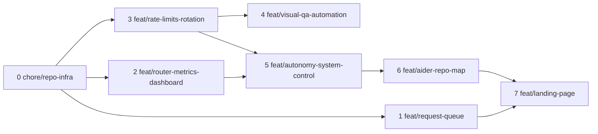

# תוכנית קומיטים וענפים — עבודה לא-מחויבת (Commit & Branch Plan)

> **מטרת מסמך זה:** לתעד את כל העבודה הלא-מחויבת כרגע ב-working tree, לחלק אותה לפיצ'רים קוהרנטיים, ולתת לכל פיצ'ר ענף משלו עם רשימת קבצים מדויקת, הודעת commit וסדר מיזוג. כל ת'רד עתידי יכול לקחת ענף מהרשימה ולבצע אותו.
>
> **תאריך עדכון אחרון:** 2 באוגוסט 2026
> **בסיס:** `main` ב-`10ac0e5` (אחרי מיזוג PR #30)

---

## 1. תמונת המצב

```
129 קבצים "משונים" ב-working tree
├── 23 קבצים קיימים עם שינוי תוכן אמיתי (numstat ≠ 0)
├── ~31 קבצים חדשים (feature code + tests + docs)
└── ~100 קבצים "פנטום CRLF" — status מראה M, אך git diff ריק
```

### 1.1 פנטום CRLF (ללא תוכן)

כ-100 קבצים מופיעים כ-modified אך **אין בהם שינוי תוכן** — רק הבדל סופי-שורה (LF→CRLF) שנגרם על ידי `pnpm format` (biome format --write) על Windows עם `core.autocrlf=true`. דוגמאות: כל ה-`lib/db/migrations/meta/*_snapshot.json`, `lib/session/*`, `lib/sandbox/*`, `biome.json`, `tsconfig.json`, `vercel.json`, `dictionaries/*` ועוד.

**החלטה:** אין להעלות קבצים אלה לשום קומיט — הם מרעישים את ה-diff ללא ערך. **Staging חייב להיעשות לפי רשימות קבצים מפורשות, לעולם לא `git add -A`.**

### 1.2 קובץ אשפה

- `**תאריך` (0 בתים, שם פגום) — artifact אקראי, **למחיקה, לא לקומיט**.

---

## 2. תלות בין הפיצ'רים



---

## 3. סדר המיזוג המומלץ

| # | ענף | Commit message | תלוי ב | הערות |
|---|---|---|---|---|
| 0 | `chore/repo-infra` | `chore: add vitest, validate-docs script, architecture doc` | — | **חובה ראשון** — מתקן את pre-commit hook |
| 1 | `feat/request-queue` | `feat: user request queue with reorderable backlog and auto-advance dispatch` | 0 | **פותר את שבירת ה-Vercel** — הכי דחוף |
| 2 | `feat/router-metrics-dashboard` | `feat: routing observability with LRU cache and metrics dashboard` | 0 | תשתית לאוטונומיה |
| 3 | `feat/rate-limits-rotation` | `feat: provider rate-limit tracking, key rotation, and LLM retry` | 0 | תשתית לאוטונומיה + Visual QA |
| 4 | `feat/visual-qa-automation` | `feat: automatic visual QA with screenshot critique and run history` | 3 | תלוי ב-`retry.ts` |
| 5 | `feat/autonomy-system-control` | `feat: full-autonomy system-control tools with guided/autonomous/full levels` | 2, 3 | חולק `loop.ts` עם 6 |
| 6 | `feat/aider-repo-map` | `feat: Aider-style compressed repo map with AST symbol summaries` | 5 | חולק `loop.ts` עם 5 |
| 7 | `feat/landing-page` | `feat: marketing landing page, hero redesign, and RTL polish` | 1 | חולק `home-page-content.tsx` עם 1 |

---

## 4. פירוט קבצים לכל ענף

### ענף 0 — `chore/repo-infra`

**הודעת commit:**
```
chore: add vitest, validate-docs script, architecture doc
```

**קבצים:**

| קובץ | סטטוס | תוכן |
|---|---|---|
| `package.json` | modified | הוספת `"test": "vitest run"` + תלות `vitest` |
| `pnpm-lock.yaml` | modified | עדכון lockfile |
| `scripts/validate-docs.sh` | **new** | סקריפט ולידציית תיעוד (hook reference) |
| `ARCHITECTURE.md` | **new** | מסמך ארכיטקטורה |
| `implementation_roadmap.md` | modified | עדכון סטטוס (סעיף 2.3 ✅) |
| `docs/COMMIT_PLAN.md` | **new** | מסמך זה עצמו — נכלל בענף 0 כדי שלא יישאר orphan |

**מדוע קודם:** סקריפט הולידציה של תיעוד מועלה לשליטה-גרסה כדי שיהיה זמין ל-CI ולקישור עתידי ב-pre-commit hook (ההוק המחויב כרגע מריץ `pnpm format` בלבד). vitest נדרש על ידי כל בדיקות הפיצ'רים הבאים.

**ולידציה:** `bash scripts/validate-docs.sh` (על הקבצים עצמם) • `git add` מפורש.

---

### ענף 1 — `feat/request-queue`

**הודעת commit:**
```
feat: user request queue with reorderable backlog and auto-advance dispatch
```

**קבצים:**

| קובץ | סטטוס | הערות |
|---|---|---|
| `lib/queue/engine.ts` | **new** | מנוע תור: enqueue, reorder, merge, soft-delete |
| `lib/queue/dispatch.ts` | **new** | גישור תור → task pipeline (auto-advance) |
| `app/api/queue/route.ts` | **new** | REST API: GET/POST/PATCH/DELETE |
| `components/queue-panel.tsx` | **new** | UI פאנל התור |
| `lib/ai/orchestrator/capabilities/queue-tools.ts` | **new** | כלי סוכן לתור |
| `lib/db/migrations/0035_request_queue.sql` | **new** | מגרציה (טבלת `request_queue` כבר ב-schema.ts) |
| `components/home-page-content.tsx` | modified | **רק** שורות ה-`QueuePanel` (37, 709) — חלוקת hunks ב-`git add -p` |

**חשוב:** `components/home-page-content.tsx` מכיל גם עבודת hero של פיצ'ר 7. יש לבצע staging **רק של ה-hunks של QueuePanel** (`import { QueuePanel }` + `<QueuePanel />`), ולהשאיר את שאר הקובץ ב-working tree לפיצ'ר 7.

**מדוע דחוף:** `home-page-content.tsx` המחויב כבר מייבא `QueuePanel` — לכן ה-Vercel build נשבר ב-main עצמו (וזהו גם כשל ה-Vercel שראינו ב-PR #30).

**ולידציה:** `pnpm type-check` • `bash scripts/validate-docs.sh` • `pnpm format:check` על הקבצים.

---

### ענף 2 — `feat/router-metrics-dashboard`

**הודעת commit:**
```
feat: routing observability with LRU cache and metrics dashboard
```

**קבצים:**

| קובץ | סטטוס |
|---|---|
| `lib/ai/router-metrics.ts` | **new** |
| `lib/ai/router-cache.ts` | **new** |
| `app/api/metrics/routing/route.ts` | **new** |
| `components/routing-metrics-dashboard.tsx` | **new** |

**הערות:**
- ה-dashboard עדיין לא מותקן באף עמוד — קיים כ-component בלבד. הרכבה (למשל ב-`app/layout.tsx` או בתפריט) — משימה המשך, לא חובה לענף זה.
- `lib/ai/smart-router.ts` / `lib/ai/router.ts` הם **פנטום CRLF** — לא נכללים כאן.

**ולידציה:** `pnpm type-check`.

---

### ענף 3 — `feat/rate-limits-rotation`

**הודעת commit:**
```
feat: provider rate-limit tracking, key rotation, and LLM retry
```

**קבצים:**

| קובץ | סטטוס |
|---|---|
| `lib/rate-limits/types.ts` | **new** |
| `lib/rate-limits/tracker.ts` | **new** |
| `lib/rate-limits/rotator.ts` | **new** |
| `lib/rate-limits/manager.ts` | **new** |
| `lib/ai/retry.ts` | **new** — `withRetry` (backoff+jitter) |

**הערות:**
- טבלת `provider_usage` כבר קיימת ב-`lib/db/schema.ts` המחויב (b95a821) — אין שינוי schema.
- `withRetry` נדרש על ידי Visual QA (ענף 4) ולכן כאן.

**ולידציה:** `pnpm type-check`.

---

### ענף 4 — `feat/visual-qa-automation`

**הודעת commit:**
```
feat: automatic visual QA with screenshot critique and run history
```

**קבצים:**

| קובץ | סטטוס |
|---|---|
| `lib/ai/orchestrator/capabilities/visual-qa-store.ts` | **new** |
| `lib/ai/orchestrator/capabilities/visual-qa-tools.ts` | **new** |
| `lib/ai/orchestrator/capabilities/auto-visual-qa.ts` | **new** |
| `app/api/tasks/[taskId]/visual-qa/route.ts` | **new** |
| `components/visual-qa-panel.tsx` | **new** |
| `lib/db/migrations/0034_visual_qa_runs.sql` | **new** |
| `app/api/tasks/[taskId]/continue/route.ts` | modified | חיבור `runAutomaticVisualQa` + פרסיסטנציה של error מובנה |
| `lib/ai/orchestrator/task-queue.ts` | modified (3/2) | החלפת `t.error` גולמי ב-`getReadableTaskError` (שארית error-details מ-PR #30) |

**הערות:**
- `continue/route.ts` משלב שני שינויים קשורים (auto visual QA + structured error) — שניהם שייכים לענף זה (פרסיסטנציית השגיאה משלימה את ה-error-details מ-PR #30).
- `lib/ai/orchestrator/task-queue.ts` הוא שארית error-details (תלוי ב-`@/lib/api/job-errors` המחויב) — נוסף כאן כ-polish, לצד פרסיסטנציית השגיאה ב-`continue/route.ts`.
- `lib/sandbox/tools/mcp/visual-qa/index.ts` הוא פנטום CRLF — לא נכלל.

**ולידציה:** `pnpm type-check` • `npx vitest run` (אם יש test חדשים).

---

### ענף 5 — `feat/autonomy-system-control`

**הודעת commit:**
```
feat: full-autonomy system-control tools with guided/autonomous/full levels
```

**קבצים:**

| קובץ | סטטוס | תוכן |
|---|---|---|
| `lib/ai/orchestrator/capabilities/system-tools.ts` | **new** | כלי שליטה במערכת (sandboxes, API keys, rate limits, tasks) |
| `lib/ai/orchestrator/capabilities/system-tools.test.ts` | **new** | |
| `lib/ai/orchestrator/capabilities/plan-tools.test.ts` | **new** | |
| `lib/ai/orchestrator/capabilities/types.ts` | modified | `AutonomyLevel` type |
| `lib/ai/orchestrator/capabilities/index.ts` | modified | רישום `system` pack |
| `lib/ai/orchestrator/modes.ts` | modified | הוספת pack |
| `lib/ai/orchestrator/state.ts` | modified | `autonomyLevel` state |
| `lib/ai/orchestrator/capabilities/plan-tools.ts` | modified | `blocksExecution` לפי autonomy |
| `app/api/tasks/route.ts` | modified | פרמטר `autonomyLevel` (ברירת מחדל `full`) |
| `lib/ai/orchestrator/loop.ts` | modified | **חלק האוטונומיה בלבד** (system pack injection + autonomy instructions) |

**חשוב:** `loop.ts` משותף עם ענף 6 (repo map). חלוקת hunks ב-`git add -p`: האוטונומיה בענף 5, והזרקת ה-repo map בענף 6. **חלופה:** לאחד 5+6 לענף אחד `feat/orchestrator-capabilities` אם חלוקת ה-hunks מורכבת מדי.

**ולידציה:** `pnpm type-check` • `npx vitest run lib/ai/orchestrator/capabilities/system-tools.test.ts lib/ai/orchestrator/capabilities/plan-tools.test.ts`.

---

### ענף 6 — `feat/aider-repo-map`

**הודעת commit:**
```
feat: Aider-style compressed repo map with AST symbol summaries
```

**קבצים:**

| קובץ | סטטוס |
|---|---|
| `lib/ai/orchestrator/capabilities/aider-repo-map.ts` | **new** |
| `lib/ai/orchestrator/capabilities/aider-repo-map.test.ts` | **new** |
| `lib/ai/orchestrator/capabilities/repo-map.test.ts` | **new** |
| `lib/ai/orchestrator/capabilities/repo-map.ts` | modified (148/269) — שכתוב Aider |
| `lib/ai/orchestrator/loop.ts` | modified — **חלק ה-repo map בלבד** |

**ולידציה:** `pnpm type-check` • `npx vitest run lib/ai/orchestrator/capabilities/aider-repo-map.test.ts lib/ai/orchestrator/capabilities/repo-map.test.ts`.

---

### ענף 7 — `feat/landing-page`

**הודעת commit:**
```
feat: marketing landing page, hero redesign, and RTL polish
```

**קבצים:**

| קובץ | סטטוס | תוכן |
|---|---|---|
| `app/landing/page.tsx` | **new** | עמוד `/landing` |
| `components/landing-page.tsx` | **new** | קומפוננטת landing |
| `app/layout.tsx` | modified | IBM Plex fonts + RTL dynamic (`lang`/`dir`) |
| `app/globals.css` | modified (150/68) | סגנונות landing + dashboards |
| `components/home-page-content.tsx` | modified | **חלק ה-hero + לינק `/landing`** (השאר אחרי ענף 1) |
| `components/capabilities-page.tsx` | modified (87/3) | טבלת קודי שגיאה + לינק `/landing` |
| `components/connectors/manage-connectors.tsx` | modified | RTL fix (`space-x→gap`, `ms`/`me`) |
| `components/platform-api-keys.tsx` | modified | RTL fix |
| `components/repo-issues.tsx` | modified | RTL fix |
| `components/repo-pull-requests.tsx` | modified | RTL fix |
| `components/task-form.tsx` | modified | RTL fix |
| `components/task-sidebar.tsx` | modified | RTL fix |

**חשוב:** ה-hunks של `home-page-content.tsx` בענף זה הם כל מה שנשאר אחרי שענף 1 הוציא את שורות ה-QueuePanel. אם ענף 7 מגיע לפני 1 — יש להקפיד להשאיר את ה-import של QueuePanel בחיים (או לסנכרן לפי סדר).

**ולידציה:** `pnpm type-check` • `bash scripts/validate-docs.sh` • `pnpm format:check`.

---

## 5. נקודות קריטיות

### 5.1 Migrations 0034 / 0035
טבלאות ה-DB (`visualQaRuns`, `requestQueue`, `providerUsage`) כבר מחויבות ב-`lib/db/schema.ts`, אבל קבצי ה-SQL (`0034_visual_qa_runs.sql`, `0035_request_queue.sql`) וסטטוס ה-`_journal.json` לא עודכנו. לפני קומיט 1 ו-4:
- להריץ `pnpm drizzle-kit generate` לסנכרון ה-journal וה-snapshots (הם כרגע פנטום-CRLF, לא תוכן אמיתי)
- לוודא שה-migration SQL תקין מול ה-schema

### 5.2 קבצים משותפים (shared files)
| קובץ | ענפים |
|---|---|
| `lib/ai/orchestrator/loop.ts` | 5 + 6 (חלוקת hunks) |
| `components/home-page-content.tsx` | 1 + 7 (חלוקת hunks) |

### 5.3 מצב ה-CI
- **שגיאות lint (175) קיימות-מראש ב-main עצמו** — כל PR חדש יראה את ה-`quality` check אדום בשלב `biome lint` ללא קשר לתוכן. הענף לא מוגן → ניתן עדיין למזג. טיפול ברקע: ת'רד נפרד לתיקון ה-backlog.
- **Vercel:** ענף 1 מתקן את ה-build (מחייב את `queue-panel.tsx`).

### 5.4 כיבוד פנטום ה-CRLF
בכל staging — רשימה מפורשת בלבד. להזכיר בכל ת'רד: `git add` לפי רשימה, לעולם לא `git add -A` או `git add .`.

---

## 6. ולידציה לכל PR (checklist)

```bash
# 1. Type check
pnpm type-check

# 2. בדיקות רלוונטיות (לפי הענף)
npx vitest run <files>

# 3. תיעוד
bash scripts/validate-docs.sh

# 4. Format check (על הקבצים שהשתנו בלבד)
pnpm exec biome format --check <files>

# 5. Staging מפורש + commit
git add <explicit-files>
git commit -m "<message>"

# 6. Push + PR מול main
git push -u origin <branch>
gh pr create --base main --head <branch> --title "<title>" --body "<body>"
```

---

## 7. משימות המשך (לא חלק מהקומיטים)

- הרכבת `routing-metrics-dashboard` באחת מהעמודות/התפריטים
- הרכבת `visual-qa-panel` בעמוד המשימה (אם עדיין לא)
- מחיקת `**תאריך` מה-working tree
- הוספת `.gitattributes` עם `text=auto` + `git add --renormalize` לניקוי רעש ה-CRLF
- תיקון 175 שגיאות ה-lint הקיימות-מראש (ת'רד נפרד)
